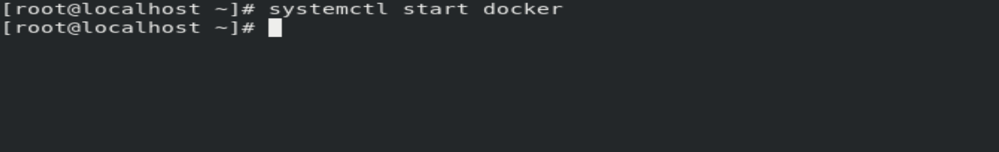

# Docker_task7.2-b-
Setting up python interpreter and running python code on docker container.
First of all i have to start docker service by using command:-
systemctl start docker

Then i have to launch a docker container by using command:-
docker run -it --network host --name myos centos:latest

To install python interpreter in container used command :- yum install python3

I have successfully installed python interpreter

Then i try to run python interpreter and run code of python.

Finally, i run successfully python code on docker container.

Thank you !

